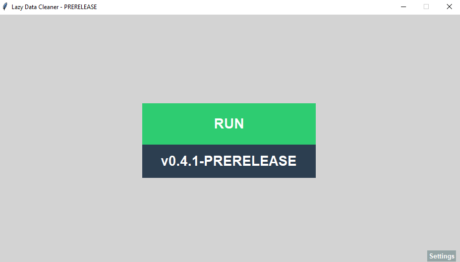
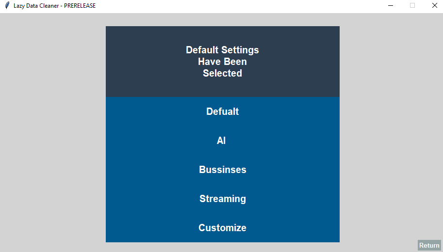
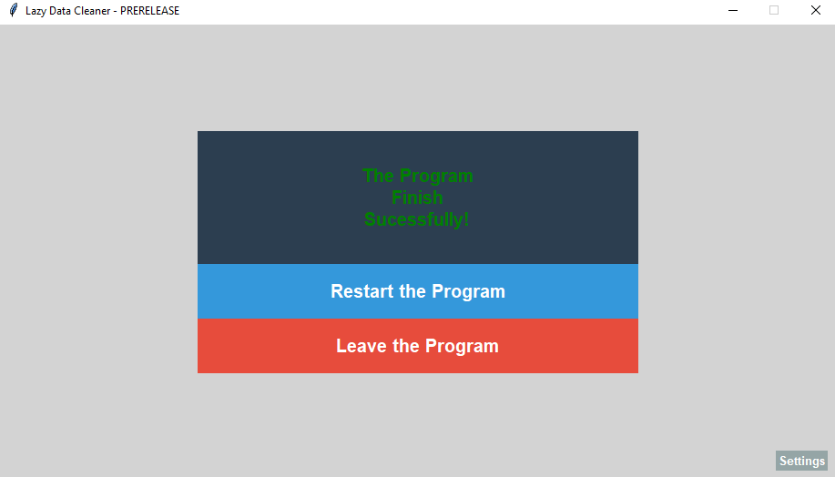

# Lazy Data Cleaner

**Lazy Data Cleaner** is a simple data cleaning tool designed to help preprocess datasets with accuracy and efficiency. It focuses on ease of use and quick setup, making basic data cleaning accessible even for beginners.

**Currently,** the program supports cleaning `.csv` datasets only.

# REQUIREMENTS

- **Operating System:** Windows

- **Python:** 3.13 or higher

## Libraries Required

- Colorama

- pandas

- numpy

All dependencies are **mandatory** to run the program successfully.

# How to Run

1. Place your `.csv` file inside the **`Upload`** folder.

2. Double-click **`run.bat`** to start the application.

3. The program will process the dataset.

4. The cleaned dataset will appear in the **`Data`** folder.

The console window (**`cmd`**) will display processing logs.

**Do not close the console while the program is running.**

# About Files Processing

The program **never modifies or deletes** files located in the **`Upload`** folder.

Instead:

- Files are **copied**

- Cleaning operations are performed on the **copied version**

- Results are saved inside the **`Data`** folder

This ensures your original data always remains unchanged.

# Here Are Images of the Program

## Starting Screen Screen

## Settings Screen

## Main Screen

**All Screens are accessable.**

# Cleaning Presets

At the moment, the program provides **five cleaning presets**:

## Default   

- Fill in the **mean**.
  
- Fill in the **mode**.

- Remove **outlier**.
  
- Remove **duplicates**.

## AI

- Fill in the **median**.

- Fill in the **mode**.

- Remove **outlier**.

- Remove **duplicates**.

- Apply **standardization**.

## Business

- Fill in the **mode**.

- Remove **duplicates**.

## Streaming 
 
- Fill in the **mode**.

-  Remove **outlier**.
  
-  Remove **duplicates**.

## Custom

Currently redirects to the **Default preset.**

A **custom configuration menu** is planned for `v0.4.2-PRERELEASE` 

# Development Status

The project is currently under **active development.**

Features, presets, and workflows may change in future releases.

# Credits

Special thanks to the following contributors:

- **@Atesthecoder** - for designing interface the **BETA first GUI**.

- **@Qoyyuum** - for testing the code and giving feedback throught the journey.

# License

This project is licensed under a **Personal Use Only License**.

You **may not:**

- Redistribution the project

- Modification the source code

- Use the software commercially

without **explicit permission from the author.**
