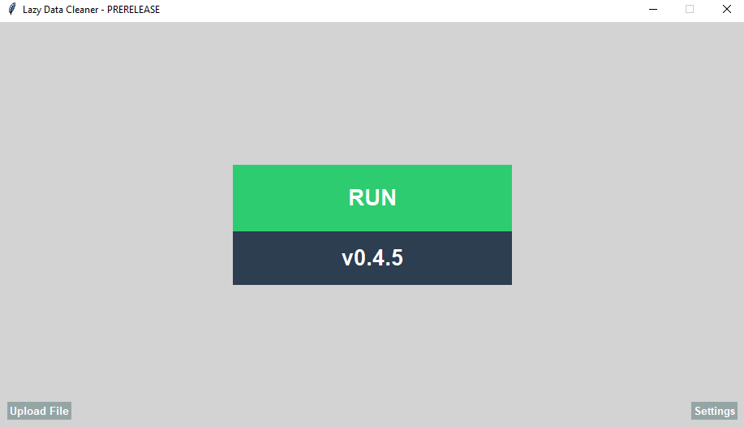
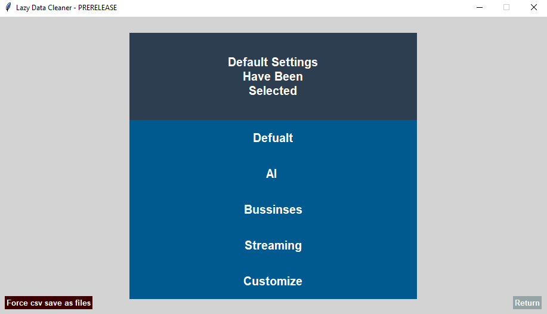
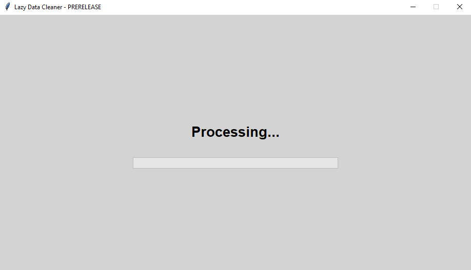
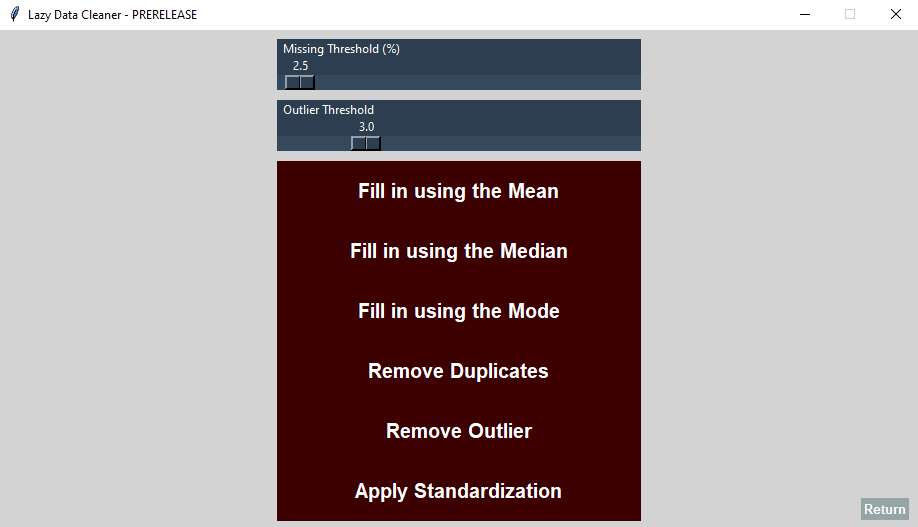
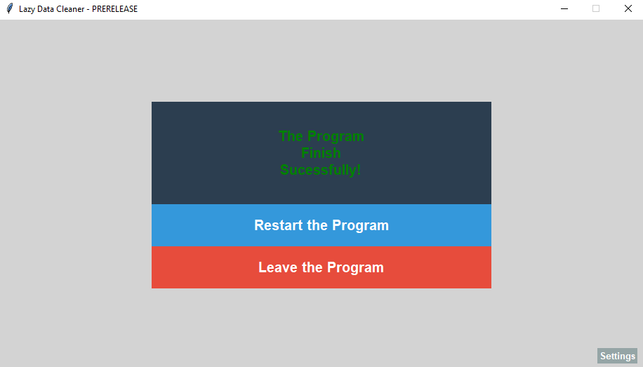

# ABOUT LAZY DATA CLEANING

**Lazy Data Cleaner** is a lightweight dataset cleaning tool designed to preprocess data quickly and efficiently. It focuses on simplicity, making essential data cleaning accessible even for beginners.

**Currently,** the program supports the following file formats:

- `.csv`
- `.xlsx`
- `.xls`

(More file fomats support might be added on request)

# REQUIREMENTS

## System Requirements

- **Operating System:** Windows

- **Python:** 3.13 or higher

## Python Dependencies

See `requirements.txt` for the full list of required libraries.

## Installation

Install dependencies using:

`py -m pip install -r requirements.txt`

# HOW TO RUN

1. Place your dataset file inside the **`Upload`** folder

*(Alternatively, use the `Upload File` button in the application)*

2. Double-click **`run.bat`** to start the application

3. The program will automatically process your dataset

4. The cleaned dataset will be saved in the **`Data`** folder.

The console window (**`cmd`**) will display processing logs.

**Do not close the console while the program is running.**

# ABOUT FILE PROCESSING

The program **never modifies or deletes** files located in the **`Upload`** folder.

Instead:

- Files are **copied**

- Cleaning operations are performed on the **copied version**

- Results are saved inside the **`Data`** folder

This ensures your original data always remains unchanged.

# APPLICATION SCREENS

## Starting Screen

## Settings Screen

## Progress Bar Screen

## Customize Screen

## End Screen

**All Screens are accessible within the application.**

# CLEANING PRESETS

At the moment, the program provides **five cleaning presets**:

## Default   
  
- Remove **duplicates**.

## AI

- Fill missing values with **median**.

- Fill missing values with **mode**.

- Remove **outliers**.

- Remove **duplicates**.

- Apply **standardization**.

## Business

- Fill missing values with **mode**.

- Remove **duplicates**.

## Streaming 
 
- Fill missing values with **mode**.

-  Remove **outliers**.
  
-  Remove **duplicates**.

## Custom

Allows users to manually select cleaning operations through a configuration menu.

Custom threshold configuration is **not yet available**.

# DEVELOPMENT STATUS

The project is currently under **active development.**

Features, presets, and workflows may change in future releases.

# CREDITS

Special thanks to:

- **@Atesthecoder** - for designing interface the **initial GUI**.

- **@Qoyyuum** - for testing the code and giving feedback throughout the journey.

# LICENSE

This project is licensed under the **MIT License**.

## You are free to:

- Use the software for personal and commercial purposes

- Modify the source code

- Distribute the project

## Under the condition that:

- The original copyright and license notice are included

For full details, see the `LICENSE` file.
